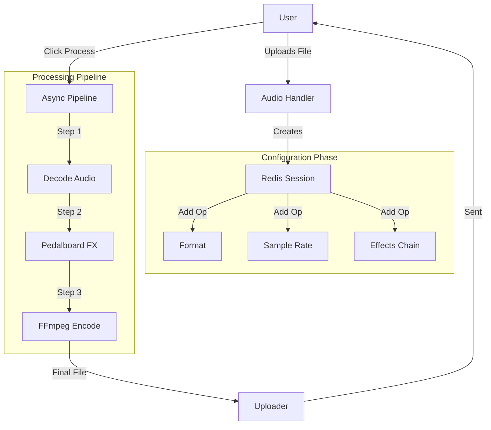

<div align="center">

# 🎵 TarangFX v2.0.0-beta

### The Modern Audio Mastering Bot

*Professional-grade audio processing pipeline built on Telethon & Spotify's Pedalboard.*

[](https://www.gnu.org/licenses/agpl-3.0)
[](https://github.com/PN-Projects/TarangFX/releases)
[](https://github.com/spotify/pedalboard)
[](https://t.me/TarangFXbot)

[Features](#-key-features) • [Installation](#-installation) • [Architecture](#-architecture) • [Usage](#-usage-guide)

</div>

---

## 🚀 About v2.0.0-beta

TarangFX v2 is a complete rewrite focusing on **speed**, **quality**, and **stackable effects**. Unlike the previous version, v2 allows you to chain multiple operations (e.g., "Convert to FLAC" + "Bass Boost" + "Reverb") into a single processing session.

**Key Upgrades in v2:**
*   **Engine**: Switched from pure FFmpeg to **Spotify's Pedalboard** for studio-quality effects (VST-like processing).
*   **Core**: Migrated from Pyrogram to **Telethon** for better async handling and session management.
*   **Workflow**: New "Session" system. Configure everything first, then process once.
*   **Performance**: Redis caching for rate limits and session state.

---

## ✨ Key Features

### 🎧 Audio Processing
*   **Format Conversion**:
    *   **Free**: MP3, AAC, OGG, OPUS
    *   **Premium**: FLAC, WAV, AIFF, ALAC (Lossless)
*   **Bitrate Control**: 128kbps, 192kbps, 256kbps, 320kbps, and **Original** (Pass-through).
*   **Sample Rate**:
    *   **Free**: 22.05kHz, 44.1kHz
    *   **Premium**: 48kHz, 96kHz (High-Res)

### 🎛️ Studio Effects (Premium)
Powered by **Pedalboard**, allowing granular control:
*   **Bass Boost**: Frequency-targeted boosting (20Hz - 120Hz).
*   **Vocal Enhancement**: Presets for Male and Female vocals.
*   **Standard FX**: Reverb, Delay, Distortion, Chorus.
*   **Smart Normalization**: Available to all users.

### ⚡ Infrastructure
*   **Async Operations**: Non-blocking downloads and uploads.
*   **Concurrency Control**: Limits active operations per user to prevent server overload.
*   **Privacy**: Temp files are isolated by User ID and auto-deleted after processing.

---

## 🛠️ Architecture

TarangFX v2 uses a modular pipeline architecture:



---

## 📦 Installation

### Prerequisites
*   Python 3.10+
*   FFmpeg (Installed and in PATH)
*   Redis Server (for session caching)

### Local Setup

```bash
# 1. Clone Repo
git clone https://github.com/PN-Projects/TarangFX.git
cd TarangFX

# 2. Virtual Env
python -m venv venv
# Windows
.\venv\Scripts\Activate
# Linux/Mac
source venv/bin/activate

# 3. Install Deps
pip install -r requirements.txt

# 4. Configure .env
cp .env.example .env
# Edit .env with your API_ID, API_HASH, BOT_TOKEN, REDIS_HOST etc.

# 5. Run
python bot.py
```

### Docker Setup

```yaml
version: '3.8'

services:
  redis:
    image: redis:alpine
    restart: always

  bot:
    build: .
    restart: always
    env_file: .env
    depends_on:
      - redis
```

---

## 🤖 Usage Guide

1.  **/start**: Initialize the bot.
2.  **Upload Audio**: Send any audio file.
3.  **Configure Session**: Use the inline buttons to add operations:
    *   `🔄 Convert`: Change format.
    *   `📊 Sample Rate`: Up/Downsample.
    *   `💿 Bitrate`: Adjust quality.
    *   `🎛️ Effects` (Premium): Add creative effects.
    *   `📈 Normalize`: Level audio.
4.  **Process**: Click `✅ Process` to apply all selected operations in order.

---

## ⚙️ Configuration (.env)

| Variable | Description |
| :--- | :--- |
| `API_ID` | Telegram API ID |
| `API_HASH` | Telegram API Hash |
| `BOT_TOKEN` | Bot Token from @BotFather |
| `REDIS_HOST` | Redis Host (default: localhost) |
| `REDIS_PORT` | Redis Port (default: 6379) |
| `OWNER_ID` | Your Telegram User ID (for admin commands) |
| `FORCE_SUB_CHANNEL` | (Optional) Channel username to force join |

---

## 🤝 Contributing

We welcome contributions! Here's how you can help:

1. **Fork** the repository
2. **Create** a feature branch (`git checkout -b feature/amazing-feature`)
3. **Commit** your changes (`git commit -m 'Add amazing feature'`)
4. **Push** to the branch (`git push origin feature/amazing-feature`)
5. **Open** a Pull Request

---

## 👨‍💻 Meet the Team

<table>
<tr>
<td align="center">
<a href="https://t.me/dotenv">
<br />
<sub><b>Parthiv Katapara</b></sub>
</a><br />
<sub>Core Developer</sub>
</td>

<td align="center">
<a href="https://t.me/PrabodhNandini">
<br />
<sub><b>Avika Trivedi</b></sub>
</a><br />
<sub>Core Developer</sub>
</td>

<td align="center">
<a href="https://t.me/shhhwrma">
<br />
<sub><b>Anand Sharma</b></sub>
</a><br />
<sub>Core Developer</sub>
</td>
</tr>
</table>

---

## 🌟 Support

If you find TarangFX helpful, consider:

- ⭐ **Starring** this repository
- 🐛 **Reporting** bugs or suggesting features via [Issues](https://github.com/PN-Projects/TarangFX/issues)
- 💬 **Sharing** with others who might benefit
- 📱 **Trying** the bot at [@TarangFXbot](https://t.me/TarangFXbot)

---

## 📜 License

This project is licensed under the **GNU Affero General Public License v3.0**.

---

<div align="center">
Made with ❤️ by <b>PN Projects</b>
</div>
